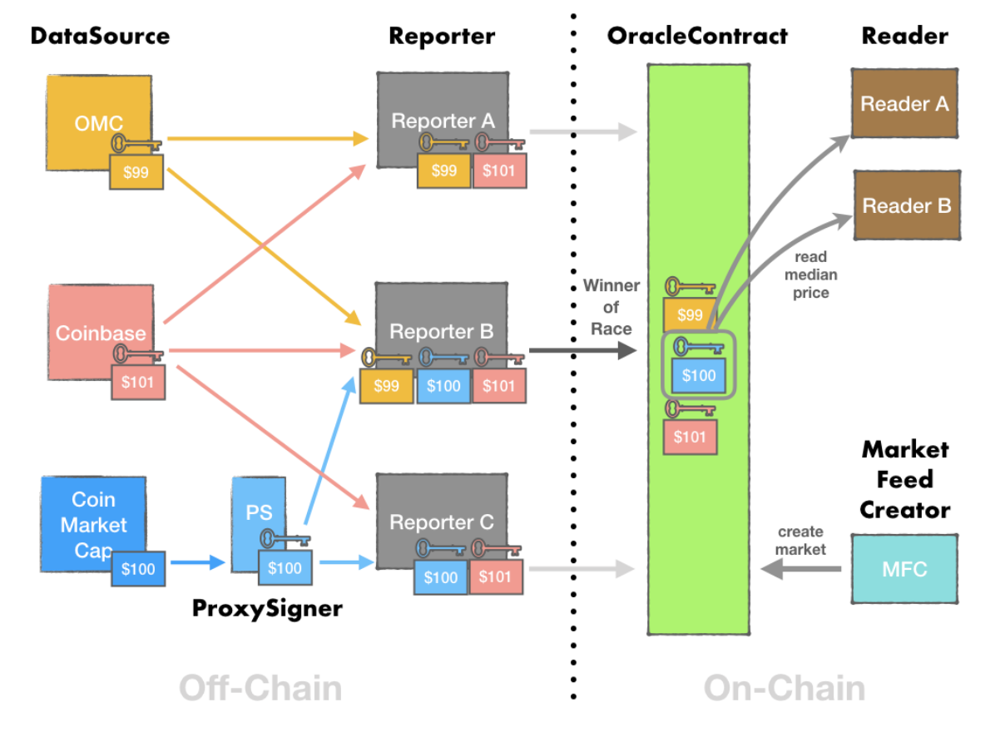

# Pricefeed Oracle - Draft v0.1 (Feedback welcome)

## Abstract
An Oracle makes off-chain data available for use in smart-contracts. Enabling integration with external data sources is one of the biggest challenges for the mainstream adoption of blockchain technologies. DIRT presents an oracle design for data feeds. We describe a protocol to report data on chain that is provably correct using signed messages, and a reward mechanism to incentivize efficiency and redundancy. The protocol further introduces the concept of an Oracle Security Check to make the system resilient to economic attacks and bribes. 

## Introduction
Many applications for blockchains and smart contracts require access to off-chain data. For example, asset backed loans like Maker require the price of Ethereum to value the collateral. An oracle is the mechanism to bring off-chain data on-chain. 

Projects like Augur, Chainlink, UMA, and others make important contributions to oracle design, and DIRT is inspired by their work. Oracle designs fall into three categories:

* Single trusted node - Centralized oracles require trust in the API source. They are fast to update because only a single node needs to report. However, a single source increases the level of trust readers of the data need to provide to the oracle. Single sourced oracles are more vulnerable to corruption and can be a single point of failure. 

* Consensus through multiple, trusted nodes - Multiple nodes poll for the same data and report the data onchain. A smart contract collects all inputs and writes the median value onchain. By distributing the reporting mechanisms across multiple nodes, this approach protects against corruption or failures of any one node. While this approach creates greater redundancy in the system, it relies on trusted, pre-approved nodes. For example, to prevent sybil attacks, ChainLink requires nodes to register with the platform. Projects like Maker, ChainLink, Witnet, Rlay, Verity, and Tellor use this approach.

* Schelling point voting with any node - Prediction market systems like Augur use Schelling Point voting schemes to incentivize truthful reporting. These systems are the most decentralized as they do not depend on any one source and instead rely on users to report the data. Users vote on the outcome of an event, stake tokens to signal their confidence, and earn rewards for voting correctly. Schelling point voting systems trade efficiency for decentralization. As each vote requires human voting, there is a longer time to consensus as the system must give enough participants time to vote.

DIRT’s Oracle Platform focuses on a specific use case for oracles of data feeds (e.g. prices) and targets open finance applications. Open Finance is the fastest growing category of decentralized applications. A growing number of services for collateralized loans (Dharma), asset backed stablecoins (Maker), decentralized derivatives (DyDx), and synthetic exchanges (Abra, Synthetix) all rely on off chain data feeds.

Part of the challenge in building a data feed oracle is the friction between efficiency and trust. An oracle designed for data feeds must be reliable, trustworthy, and efficient. Oracle implementations today addresses some but not all of these requirements. By creating a price feed oracle, DIRT aims to fill a critical piece of the open finance ecosystem and unlock more mainstream use cases for blockchain applications. 

## DIRT Oracle Design

A marketfeed is a regularly updating, on-chain data (ex: ETH-USD). Any user can use DIRT to create a new marketfeed by defining an array of accepted sources. 

The three components of the DIRT oracle system work together to send data onchain:
* DataSource - external data-sources providing signed messages to use for on-chain verification 
* Reporters - off-chain nodes responsible for transporting data on-chain
* Oracle Security Check - a voting based dispute resolution protocol to detect and prevent corrupted data. 

### Data Sources: Trusted off-chain sources
DIRT uses public key encryption to verify the data came from approved sources. Each marketfeed is created with an array of approved sources. Every data source has a public / private key pair. The source uses the private key to sign the data message off-chain. The DIRT oracle contract uses the stored public key to verify the data’s origin onchain. 

The smart contract accepts the message only when all conditions are met:

* Properly signed - All data messages are signed by the set of approved sources for the market feed. The entire message is rejected if any data is improperly signed.
* Sorted - Data must be sorted in ascending order.
* Includes at least N sources - A minimum number of whitelisted sources must report. The median value from all sources is stored on-chain.
* Latest data source timestamp - Every data point must be after the previously recorded time stamp. If any source includes an earlier timestamp, the entire list is rejected.

The DIRT oracle writes the median value of all sources onchain. To protect the data from corruption or failures from any one source, DIRT recommends, but does not enforce, multiple sources per marketfeed. A marketfeed for ETH-USD should sample prices from multiple exchanges so a flash crash on a single exchange would not affect the median value.
Readers of a marketfeed must implicitly trust the sources to use that marketfeed. For example, for an ETH-USD marketfeed that uses Coinbase and Binance as sources, the reader must implicitly trust Coinbase and Binance. If a user does not trust the sources for a marketfeed, they can create a new marketfeed and define their own set of trusted proxies. DIRT provides an open source proxySigner service that allows users to run and sign their own messages. 

### Data Transport: Sending data on-chain
Reporters are off-chain services responsible for transmitting data on-chain. To make the system fault tolerant and quick to update, DIRT incentivizes reporters to compete to write the data onchain. The first reporter to send an approved message on chain earns a reward. Anyone can run a reporter and reporters cannot manipulate messages in transit. The smart contract validates all messages using public key encryption and rejects manipulated data. 

Reporters fetch data from multiple sources, organize the data responses into a sorted list, and send the sorted list on-chain. Sorting the data off-chain minimizes on-chain processing and saves gas. A sorted list proves that each reporter considered all sources instead of a single one. 

### Oracle Security Check: Protection against bribes
The Oracle Security Check (OSC) works with DIRT token holders to form the last line of defense for the DIRT oracle platform. The OSC prevents malicious behavior in the system by making it costly for a malicious actor to bribe sources and rewards users for spotting an incorrect source. 

OSC is inspired by the Andon system in Japanese manufacturing. Under the Andon system, any assembly line worker can ring an alert. It gives the average worker the ability, and moreover the empowerment, to fix any issue in the production line. By immediately highlighting errors, Andon promotes transparency in the manufacturing process and yields higher quality products.

The OSC system protects data quality by giving any DIRT token holder the power to challenge any incorrect data in the network. Any user who detects malicious or incorrect data can initiate a challenge to contest the accuracy of the data and the data source. To prevent trivial challenges that waste network attention, a token stake is required to initiate a challenge. 

After a user initiates a challenge, DIRT token holders review the suspect data and vote to approve or reject the challenge. Votes are weighted by the number of tokens staked and the winner is the side with the greater token count. If the challenge is approved, the data point is removed from the list and the data source is removed from the market. If the challenge is rejected, nothing changes regarding the data and the challenger loses their token stake. 

To profit from an attack, a malicious actor would need to acquire over half of the tokens in the DIRT network. The OSC deters attacks by making it prohibitively expensive for malicious actors to succeed. 

The v1 design depends on the Oracle building out a system of challenges and voting for the dispute resolution. An alternative approach is integrating services like UMA Protocol for the Oracle Security Check.

### Alice and Bob: Dispute resolution with the OSC
Alice and Bob open a futures contract betting on the price of Ethereum for $1M with an initial margin deposit of $100k. Alice bets that Ethereum will be more than $200 in one month and Bob bets that it will be less than $200. The contract settles based on a DIRT ETH-USD marketfeed that sources data from Coinbase, Binance, and Kraken at a specified time.

In the happy path, Alice and Bob agree with the settlement price reported by the DIRT oracle. The futures contract terminates without dispute. 

In the unhappy path, Bob bribes three of the five data sources and manipulates the price. While the price of Ethereum is $220 at the resolution time on Coinbase, the oracles reports $180. The futures contract incorrectly settles in Bob’s favor. With the OSC, Alice has a backup option. She realizes that the oracle has been corrupted and initiates a challenge. Alice submits evidence that the price of Ethereum was $220 at the resolution time. 

DIRT token holders help settle the dispute by voting on the resolution price. Pricing data is objective and easily verifiable. The voters can check the evidence supported by Alice and the data on Coinbase to cast their vote. One token equals one vote. The side with the majority of votes wins the vote. The tokens cast on the losing side are redistributed to Alice and the majority voters. 

## Incentives

There are three actors in the network: readers, reporters, and datasources. Readers provide the funding for the system to incentivize reporters to submit data on-chain. The incentives of each actor is follows:

* Readers - users of the DIRT oracle service are projects that need a decentralized, reliable, and trustworthy on-chain oracle. Today, most projects build their own oracle. A third party service saves engineering time and creates more decentralized platforms. To use the DIRT oracle, readers deposit funds into the DIRT payment contracts to whitelist their public key. Readers pay on a per-read basis.   
* Reporters - reporters earn a reward if they are the first to submit data to a marketfeed. The reward is provided by readers and keeps the oracle data up-to-date by incentivizing reporters to race to submit the latest data to the smart contract.
* Datasources - provide the initial data and sign the message for on-chain reporting. Currently, the incentive for being a proxy is to support DIRT and to gain status as a deFi supported. We plan to add an incentive to proxySigners in future upgrades. 

## Oracle Use Cases
The DIRT oracle is designed for data feeds and targets open finance applications such as Maker, Compound, dYdX, etc. Open finance is the fastest growing area in blockchain development. Users have deposited over $600 million of Ethereum as collateral, and adoption has grown over 50% in three months. The largest category of open finance applications is in asset backed loans. These applications need reliable off-chain sources to know how much to value the collateral. Moving forward, we see growing demand for oracles for more applications including synthetics (Abra), insurance (Etherisc), stable coins (Carbon), derivatives exchanges (Nuo, DyDx), etc.

## Risks and their Mitigation
* Hacking - The greatest risk in the early stages of launch is a malicious programmer finding an exploit in the deployed smart contracts, and using it to corrupt the data from the DIRT oracle before the vulnerability is fixed. In a worst case scenario, all the market feeds in the DIRT oracle report incorrect information and readers lose confidence in the data accuracy.  
Mitigation:​ Smart contract security and best security practices is the highest priority for DIRT. The codebase will undergo independent security audits by the top security researchers in the space. 
* Pricing errors and unforeseen events - A number of unforeseen events could potentially occur, such as corrupted source data feeds or high levels of congestion on the Ethereum network that prevents markets from updating. If data is not regularly updated, third party services that depend on the oracles will lose trust in the system.  
Mitigation:​ The DIRT oracles will need to supply a sufficiently higher reward to Watchers to incentivize them to safeguard the network against corrupted data. Reporters account for network congestion by adjusting the gas fee to 50% more than the currently deemed safe levels.

## Glossary of Terms
* Marketfeed: data feed that is available on-chain 
* Data sources: external APIs providing the raw data
* Proxy Signers: utility service used by data sources to sign messages 
* Reporters: external actors that bring data from off-chain on to the blockchain
* Watchers: external actors that review the data and alert the network of corrupted data sources. They form the last line of defense to prevent against economic attacks on the oracle network. 
* DIRT:​ The ERC20 token that serves as a protection against economic attacks on the oracle network. 
* DIRT ​Voters:​ DIRT holders who maintain the data quality by voting on corrupted data sources. 
                                      

